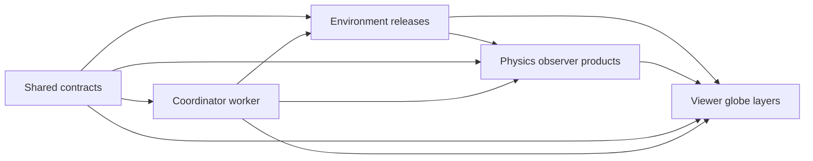

# Night Glow

Night Glow is a planned browser system for reconstructing environmental inputs,
computing physically based sky radiance, and exploring the result from a globe or
an observer on Earth. The repository is being organized before implementation so
that data production, physics, browser orchestration, and rendering can evolve
independently without duplicating scientific logic.

## Repository layout

```text
Night Glow/
├── apps/
│   ├── viewer/             production two-view application plan
│   └── reference-viewer/   runnable TypeScript/Vite baseline
├── packages/
│   ├── contracts/          canonical cross-package vocabulary and protocols
│   ├── environment/        Rust environment reconstruction and Wasm decoding
│   └── physics/            Rust physics, astronomy, solvers, and Wasm bindings
├── runtime/
│   └── browser-worker/     browser/Wasm scheduling and memory ownership
├── data/                   policy for local inputs, fixtures, and generated data
├── tools/                  future repository-wide build and release orchestration
└── implementation/         living system-level implementation checklist
```

The intended dependency direction is:



The worker coordinates independently versioned Wasm modules; it does not own
scientific equations. The Viewer owns WebGL resources and display transforms; it
does not calculate physics. Heavy global ingestion and precomputation stay in
native Rust tools, while browser computation is regional, bounded, asynchronous,
and cancellable.

## Start here

- [Implementation master plan](implementation/README.md) — system order and gates.
- [Unified contracts](packages/contracts/README.md) — canonical products, scenario,
  revisions, ownership, and runtime lifecycle.
- [Environment](packages/environment/README.md) — emission and atmospheric-state
  reconstruction.
- [Physics](packages/physics/README.md) — astronomy, radiative transfer, PSF, and
  observer products.
- [Coordinator worker](runtime/browser-worker/README.md) — browser/Wasm scheduling and
  memory boundary.
- [Viewer](apps/viewer/README.md) — production globe and observer application plan.
- [Reference viewer](apps/reference-viewer/README.md) — existing runnable baseline.
- [Data policy](data/README.md) and [tooling boundary](tools/README.md).

## Run the reference viewer

```bash
cd apps/reference-viewer
npm ci
npm run dev
```

## Root commands

The repository has one operational surface for local work, Codex, and CI:

```bash
make help               # list commands
make setup              # verify tools, install locked web dependencies, prepare Rust/Wasm
make dev                # launch the currently implemented website
make build              # build implemented web, native Rust, and Wasm targets
make check              # links, lint, web build, Rust checks, database status
make test               # deterministic reference-model verification
make db-migrate         # safe no-op until a database is introduced
make deploy-preview     # validated Vercel preview
make deploy-production  # validated Vercel production deployment
make clean              # generated build output
make clean-all          # build output plus installed Node dependencies
```

Until `apps/viewer/package.json` exists, web commands intentionally target the
runnable reference viewer. They switch automatically to the production Viewer
when its implementation is created. Deployment uses Vercel's documented `--cwd`
flow and requires an authenticated CLI; credentials are never stored here.

The repo-local Codex environment is
[`.codex/environments/environment.toml`](.codex/environments/environment.toml),
with Run, Build, Validate, Database Migration, and Preview Deployment actions.
The current application needs no runtime secrets; future variables must follow
[`.env.example`](.env.example).

The planning packages and runtime contain documentation and reserved workspace shapes;
they do not yet replace the reference implementation.
