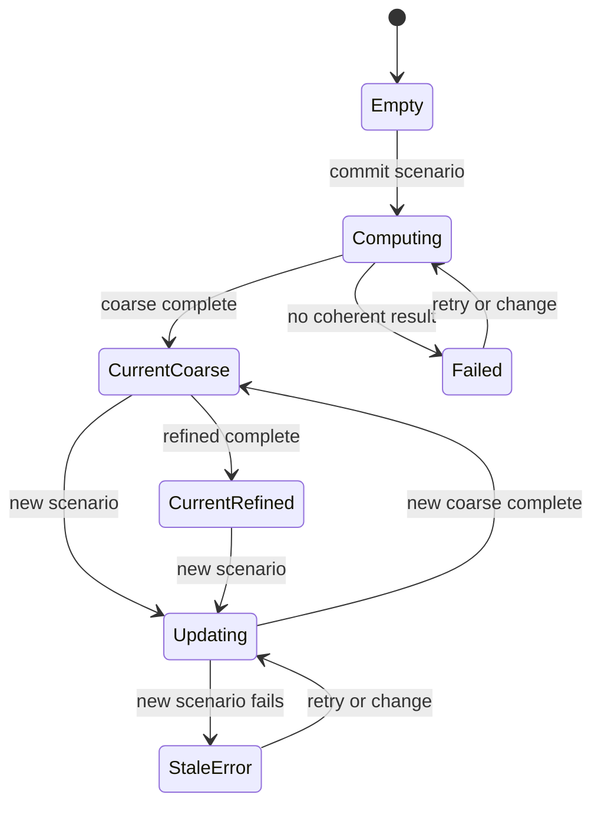

# State, navigation, and scenario revisions

## 1. Principles

- A copied URL should reproduce the same scientific question, subject to available releases.
- High-frequency render state must not pass through React or URL updates every frame.
- Preview state is cheap and reversible; committed state may start scientific work.
- Every asynchronous result is attributable to an immutable scenario revision.
- The last coherent result may remain visible during change, but stale state is labelled.

## 2. Route model

Proposed canonical routes:

```text
/globe?layer=light-emission&requested_time_utc=2026-07-17T22:00:00Z
/globe?layer=aod-550&atmosphere_mode=forecast&source_run_id=cams-20260717T12Z&valid_time_utc=2026-07-17T22:00:00Z
/observe?lat=52.2297&lon=21.0122&height=100&height_datum=ellipsoidal&requested_time_utc=2026-07-17T22:00:00Z&atmosphere_mode=forecast
```

Optional parameters can identify independent emission/atmosphere releases, selection/run/sample, source scenario, Physics model, quality request, and a compact camera orientation. A navigation URL may explicitly follow a mutable release channel, but the Viewer resolves it before committing the scenario. A generated reproducible share payload always pins the resulting immutable release, selection, Physics model and data identities.

Latitude/longitude queries are preferred over a location path segment because coordinates are state, not a content hierarchy. Human-readable place labels are display metadata and do not replace coordinates.

## 3. State ownership table

| State | Canonical owner | Persistence | Update rate |
| --- | --- | --- | --- |
| active mode | route | URL | navigation |
| committed WGS84 location/height | scenario store | URL | deliberate commit |
| preview location | view session | memory only | pointer rate, not React if necessary |
| `requested_time_utc` | scenario store | URL | deliberate commit/scrub settle |
| active pollution layer | globe store | URL | user action |
| emission/atmosphere/Physics release IDs | scenario/product manifest | URL or share manifest | rare |
| `AtmosphereSelectionMode` and required source-run/member, climatology-sample or standard-scenario identity | scenario store | compact URL or share manifest | deliberate commit |
| emission source scenario | scenario store | compact URL preset or share manifest | deliberate commit |
| globe camera | globe engine | session snapshot; optional share | frame/private |
| observer camera | observer engine | session snapshot; optional throttled URL | frame/private |
| GPU buffers/textures | engine | none | internal |
| panel layout/reduced motion | UI preferences | local storage | rare |
| `RuntimeAvailability` | runtime | memory | stage events |
| validity/evidence/uncertainty and fidelity/convergence | product descriptors | memory/inspector | product events |

## 4. Preview and commit

Location and time use the same transaction:

1. `beginPreview` freezes the committed scenario.
2. Pointer or scrub events update visual preview only.
3. `commitPreview` normalizes input, updates the URL, creates a new `scenario_revision`, and schedules work.
4. The prior revision is cancelled cooperatively.
5. The previous coherent output remains until the new coarse barrier arrives.
6. `coarse_complete` atomically swaps all required products.
7. `refined_complete` may later atomically upgrade them.

Escape/cancel restores the committed marker/time without compute.

## 5. Scenario descriptor

Conceptual, language-neutral shape:

```text
ObserverScenario
  observer_scenario_schema_revision
  scenario_revision
  observer_wgs84: latitude_deg, longitude_deg, height, height_datum
  requested_time_utc
  astronomy_time_data_ids
  emission_release_id
  emission_time_context
  emission_scenario_policy_id?
  atmosphere_release_id
  atmosphere_selection:
    mode: AtmosphereSelectionMode
    source_run_id?
    analysis_time_utc?
    valid_time_utc
    lead_duration?
    ensemble_member_id?
    observation_correction_revision?
    climatology_model_revision?
    climatology_sample_id?
    standard_scenario_id?
    interpolation_revision
    downscaling_revision
  physics_model_revision
  physics_data_manifest_id
  atmosphere_optics_model_revision
  surface_terrain_product_ids
  output_projection_and_angular_domain
  spectral_basis_or_observer_response
  quality_target
  resource_budget
```

The Viewer assigns `scenario_revision`; scientific packages assign their own schema/model/release identities. Optional selection fields are conditionally required by `AtmosphereSelectionMode`. A scenario hash may support cache lookup, but must not replace the readable descriptor in provenance. This structure is defined once in the [unified system contract](../../../../packages/contracts/README.md).

## 6. Result state machine



`Updating` and `StaleError` retain a previous result and name it as such. `Failed` has no result. A late message from any non-current revision is discarded and its buffers released.

## 7. Back, forward, reload, and sharing

- Back/forward reconstruct committed product state and restore an engine camera snapshot when compatible.
- Reload from `/observe` works without first visiting `/globe`.
- Reproducible share links pin all release and model/data identities. A separate, explicitly labelled channel-following navigation link may evolve and is never described as reproducible.
- Large custom scenarios use a content-addressed saved manifest rather than an enormous query string; this is a future product capability, not required for the first build.
- Invalid/out-of-range coordinates and unavailable releases produce a recoverable route error with nearest valid choices.

## 8. Transition resource policy

Entering observer mode:

1. preserve a small serializable globe snapshot;
2. optionally capture a transition bitmap;
3. stop the globe render loop;
4. preload the observer route/runtime after explicit intent;
5. dispose or aggressively trim globe GPU resources before allocating observer HDR targets;
6. mount the observer and release the transition bitmap after first coherent frame.

Returning reverses the sequence. The mini-map uses its own deliberately small resource budget and does not retain the full globe's layer cache.
