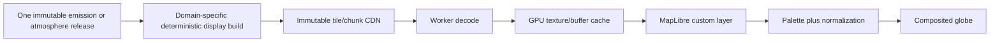

# Globe view plan

## 1. Purpose

The globe is a scientific thematic map and the geographic entry point to the observer experience. Its first family displays reconstructed artificial-light emission and independently released atmospheric products from Environment. Later plugins may add noise, water or other environmental fields.

It does not calculate skyglow. It does not pretend the colour of an Environment cell is what an observer sees in the sky.

## 2. Engine choice

Use MapLibre GL JS with globe projection and a custom WebGL layer. This provides map camera/picking, labels, vector basemaps, tile loading, attribution, and a shared engine for the observer mini-map. The custom layer keeps control of HDR decoding, palette evaluation, and specialized emission rendering.

Relevant official capabilities:

- [MapLibre GL JS documentation](https://maplibre.org/maplibre-gl-js/docs/)
- [CustomLayerInterface](https://maplibre.org/maplibre-gl-js/docs/API/interfaces/CustomLayerInterface/)
- [Custom layer on a globe example](https://maplibre.org/maplibre-gl-js/docs/examples/add-a-simple-custom-layer-on-a-globe/)
- [Raster source style specification](https://maplibre.org/maplibre-style-spec/sources/)

## 3. Data products

Authoritative Environment emission and atmosphere releases remain optimized for scientific lookup and Physics consumption. The globe may use separate derived display pyramids, but each product must be reproducible from exactly one domain release and remain linked to it by manifest.

Proposed display products:

1. **Emission overview tiles:** conservative multi-resolution source summaries.
2. **Atmosphere overview tiles:** explicitly surface, column, or selected-altitude/time statistics such as PM2.5, AOD, humidity, cloud fraction, evidence and uncertainty.
3. **Detail chunks:** authoritative emission cells or atmospheric profiles/columns for local inspection; Physics independently requests its regional scientific volumes.
4. **Query index:** compact value/support/evidence/validity/uncertainty/provenance lookup for pointer inspection.
5. **Style manifest:** permitted default ranges, units, palette, missing-state encoding, attribution.

PMTiles is worth testing as a packaging option for immutable thematic tiles because it supports range-request delivery and MapLibre integration. It is not selected until range caching, update granularity, global file size, CORS, and Vercel/CDN behavior are measured. See [PMTiles for MapLibre](https://docs.protomaps.com/pmtiles/maplibre).

## 4. Rendering pipeline



Rules:

- Aggregation conserves the declared quantity or uses an explicitly different derived statistic.
- No per-zoom auto-exposure that makes unchanged data appear to brighten when zooming.
- The legend always states whether colour represents cell intensity, density, uncertainty, change, or another statistic.
- Atmospheric legends state surface/column/altitude slice, `valid_time_utc`, `AtmosphereSelectionMode` and forecast lead or climatology/standard identity; detailed `SourceEvidenceClass` remains inspectable per value.
- Source radiometry and display palette remain separable.
- Tile borders and globe projection are validated for seams and polar behavior.
- Custom-layer GL state is restored exactly as MapLibre requires.
- Context loss triggers deterministic resource reconstruction.

## 5. Picking and pin placement

Pointer inspection returns a versioned `LayerSample`, never an untyped colour:

```ts
type LayerSample = {
  layerId: string
  coordinateWgs84: { latDeg: number; lonDeg: number }
  requestedTimeUtc: string
  validTimeUtc?: string
  spatialVerticalSupport?: string
  atmosphereSelectionMode?: 'observation_adjusted_analysis' | 'analysis' | 'forecast' | 'reanalysis' | 'climatology_sample' | 'standard_scenario' | 'insufficient'
  sourceRunId?: string
  analysisTimeUtc?: string
  leadDuration?: string
  ensembleMemberId?: string
  observationCorrectionRevision?: string
  climatologyModelRevision?: string
  climatologySampleId?: string
  standardScenarioId?: string
  value: number | number[] | null
  unit: string
  validity: 'valid' | 'missing' | 'masked' | 'censored' | 'not_covered'
  domainStatus?: string
  runtimeAvailability: 'idle' | 'loading' | 'available' | 'unavailable' | 'failed'
  uncertainty?: unknown
  sourceFeatureId?: string
  releaseId: string
}
```

For emission, `domainStatus` is the typed `CoverageStatus`; physical dark/upper-bound is not a generic validity value. Atmosphere samples expose `SourceEvidenceClass` separately in their inspector metadata. Runtime loading/failure never changes the scientific validity stored in the release.

Click/tap creates a `previewLocation`. The place card provides exact coordinates, layer value, provenance, and **Enter sky here**. Only that action—or an explicit double-click/tap preference—commits the observer route.

## 6. Visual language

- Basemap is deliberately subdued and attribution remains readable.
- The scientific layer has a unit-labelled legend with fixed, percentile, log, or domain-specific normalization explicitly named.
- Physical zero, emission supported-dark/upper-bound, missing, masked, censored, not-covered, loading and failed are distinguishable along their correct axes.
- Bright features may use a display halo only if the legend calls it emphasis and value picking uses the underlying data.
- At high zoom, cell boundaries or reconstruction footprint may be shown in scientific inspection mode.
- Time animation never interpolates through an unsupported temporal model without labelling it.

## 7. Future pollution layers

The globe engine accepts `LayerPlugin` adapters rather than Environment-specific UI branches. The initial interface should cover:

```ts
interface LayerPlugin {
  manifest: LayerManifest
  createSource(runtime: GlobeRuntime): Promise<LayerSource>
  createRenderer(context: GlobeLayerContext): GlobeLayerRenderer
  query(point: GlobeQuery): Promise<LayerSample[]>
  legend(state: LayerViewState): LegendModel
  dispose(): Promise<void>
}
```

Light emission is a `surface-scalar-directional-intensity` layer. Environment atmosphere products may be `surface_scalar`, `column`, `volume_slice`, `profile` or station overlays and must not be forced into `J_DNB`, H3, or the emission time/profile model. Layer-specific logic remains in the plugin. Cross-layer comparison is a separate product feature with explicit spatial, vertical and time-alignment policy.

## 8. Performance and LOD

- Fetch only tiles intersecting the current camera plus a bounded prefetch ring.
- Decode and build buffers in a worker.
- Reuse textures/buffers and evict by measured bytes, not only item count.
- Bound device pixel ratio separately from data LOD.
- Pause continuous rendering when the camera and time are stable; request frames on change.
- Preload observer code/data only after clear intent, not for every hovered point.
- Maintain distinct budgets for basemap, layer tiles, query index, and transition prefetch.

## 9. Globe acceptance tests

1. Surface emission and atmospheric surface/column/slice values match their independent conformance fixtures after display-tile build and decode.
2. Integrated/aggregated quantities obey their declared conservation rule at every LOD.
3. Globe seams, antimeridian, poles, tile borders, and 2-D/3-D transitions pass visual and numeric tests.
4. Picking returns the correct cell/value independent of palette and DPR.
5. Context loss restores the active layer without leaking resources.
6. `DataValidity`, emission `CoverageStatus`, atmospheric evidence, uncertainty and `RuntimeAvailability` remain distinct in rendering, legend, and query results.
7. Route transition commits the exact selected WGS84 coordinate and time.
8. Forecast run/lead, reanalysis and climatology labels survive query, URL and observer transition; no layer claims unsupported vertical or street-scale precision.
