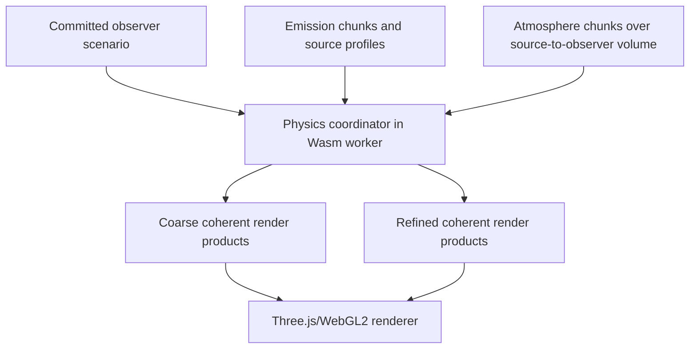

# Observer view plan

## 1. Purpose

The observer view presents the physically modelled sky from one WGS84 location, height, and time. It combines diffuse atmospheric radiance, artificial skyglow, Sun, Moon, planets, stars, Milky Way/diffuse sky, surface and terrain effects, and validated PSF products in a single coherent scenario.

The Viewer does not compute those phenomena. Physics produces versioned HDR render products; WebGL2 projects and composites them.

## 2. Entry and relocation

The committed globe pin becomes the initial observer location. Before route transition, the app may preload the observer bundle, Wasm module, and nearby immutable data. A reduced-motion preference uses a simple crossfade; otherwise a brief geographic transition may connect globe and sky.

The mini-map uses MapLibre in a low-power 2-D configuration. It shows committed and preview positions plus heading. During drag or rapid clicks:

- update the preview pin immediately;
- optionally show cheap geographic metadata;
- do not submit full Physics work;
- commit on pointer release plus debounce, or through an explicit confirmation on constrained devices;
- cancel the prior scenario once the new committed revision exists.

## 3. Observer computation pipeline



The computation graph and physical ordering remain owned by Physics. The Viewer selects a declared `AtmosphereSelectionMode` and release/run/member/sample/scenario identity but does not build optical coefficients or define the transfer domain. It may request a fidelity target and report stages, but it must not implement its own sequence of “weather first, then planets” as ad hoc UI promises. Physics publishes a stable progress vocabulary derived from its DAG.

## 4. Renderer structure

Replace the current monolithic scene component with an engine organized around resources and passes:

```text
ObserverEngine
├── CameraController
├── RenderProductRegistry
├── DiffuseSkyPass
├── StarFieldPass
├── BodyPass
├── TerrainSurfacePass
├── PsfCompositePass
├── DisplayTransformPass
├── LabelsOverlay
└── CapabilityAndBudgetManager
```

These are renderer concerns, not React components. Each pass declares accepted `observer_render_product_schema_revision` ranges, GPU formats, allocation size, fallback, and disposal behavior.

## 5. Scientific products

The initial product vocabulary follows Physics' WebGL contract:

- `sky_radiance`: diffuse HDR radiance grid/tiles in a declared projection and spectral basis;
- `star_batch`: directions, calibrated flux/basis coefficients, flags, and PSF parameters;
- `body_batch`: finite Sun/Moon/planet disk data and relevant resolved parameters;
- `surface_terrain`: horizon/occlusion/ground terms derived from the selected `SurfaceTerrainProduct`;
- `psf_basis`: normalized kernels or basis coefficients;
- `diagnostics`: separate validity, masks, fidelity/LOD, convergence/residual, interpolation and uncertainty.

The renderer rejects unknown units/projections/schema revisions instead of guessing.

## 6. HDR composition

1. Upload physically meaningful linear values to float or validated packed targets.
2. Project diffuse and resolved products into a common camera/spectral response.
3. Apply physical PSF exactly where the product contract permits.
4. Composite in linear space with order documented and tested.
5. Apply exposure/adaptation, tone mapping, gamut mapping, and output transfer exactly once.
6. Add labels and UI after the scientific display transform.

Artistic bloom is optional and must be separable. It cannot replace unresolved atmospheric scattering, lunar halo, or PSF wings.

## 7. Stars and Milky Way

- Stars are uploaded in stable batches or tiled catalogue buffers, never one Three.js object per star.
- Magnitude/flux selection is based on a declared physical and visual threshold plus LOD hysteresis.
- Sprite/quad size changes must conserve integrated flux unless a clearly named display-enhancement mode intentionally changes it.
- PSF is wavelength- and condition-aware under Physics' declared basis.
- The Milky Way/diffuse celestial map is calibrated, colour-aware, tiled, and filtered using its map PSF and atmospheric response. It is not random procedural noise.
- Catalogue and diffuse-map provenance is exposed in the inspector.

## 8. Progressive refinement and coherence

Progressive output is accepted only at coherent barriers:

1. `coarse_complete`: all required visible product families agree on the same scenario revision and fidelity tier.
2. `refined_complete`: a higher tier atomically replaces the coarse family.
3. Optional tiles may refine independently only if their boundaries, validity and mixing rule are explicitly declared.

The app may keep the last valid result while updating. It must never mix a new Moon with an old atmosphere, a new location's stars with the old sky, or partially updated radiance rows without a defined tiled contract.

## 9. Interaction and frame scheduling

- Pointer/keyboard camera motion updates engine-private state at frame rate.
- React receives throttled `camera-settled` or low-rate view summaries for the compass and URL.
- Time scrubbing uses preview and commit semantics like location movement.
- Display-only changes reuse current HDR products.
- Continuous animation runs only when camera, celestial time animation, refinement upload, or an intentional visual effect requires it.
- Mini-map renders on demand or at a low capped rate.

## 10. Quality controls

Present named profiles rather than dozens of numerical knobs:

- **Auto:** adapts within memory/frame budgets.
- **High fidelity:** prioritizes angular/spectral/PSF convergence.
- **Interactive:** prioritizes response while preserving coherent physics.
- **Constrained:** explicit reduced catalogue and grid LOD.

Scientific inspector fields may expose actual grid, source radius, spectral basis, residual, and timing. “High” must correspond to measurable error targets, not only more pixels.

## 11. Observer acceptance tests

1. Render products reproduce Physics reference images and numeric probes under the declared display transform.
2. Star integrated flux is stable across FOV, DPR, sprite size, and LOD transitions.
3. Horizon gradients converge without visible grid blocking at target quality.
4. Sun/Moon disks, atmosphere, halos, surface terms and PSF can be isolated for validation.
5. Rapid location/time changes never display mixed revisions.
6. Camera movement stays within frame budget on target devices while computation continues.
7. WebGL context loss and worker restart recover the last committed scenario.
8. Mini-map movement commits the exact new coordinate once, not once per pointer event.
9. Relocation commits emission and atmosphere identities together; the old coherent sky remains until the new regional atmosphere and all required product families reach a barrier.
