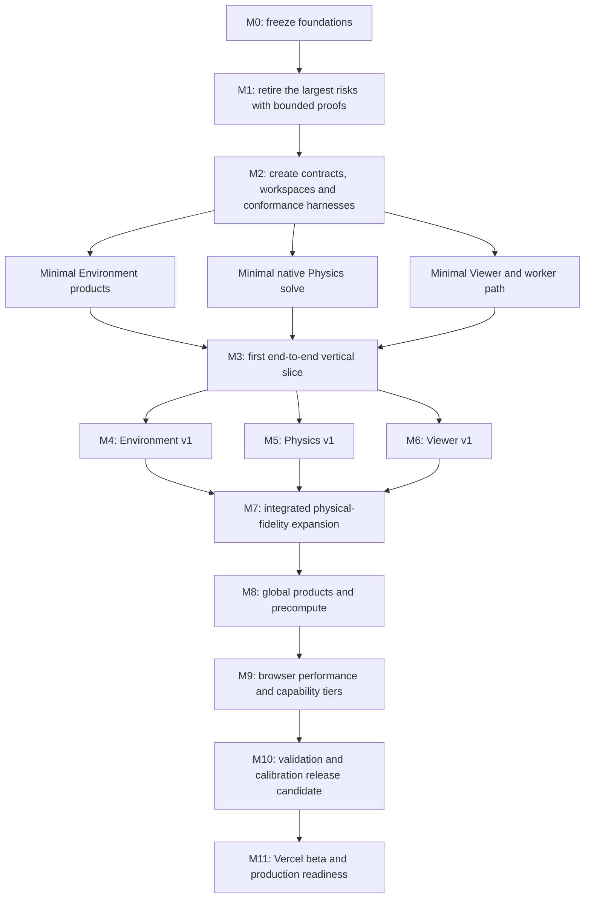

# Night Glow implementation master plan

## Purpose

This is the canonical top-level implementation checklist for Night Glow. It
controls the order in which the independent Environment, Physics and Viewer
plans are turned into a working system. Domain roadmaps remain authoritative for
their detailed work, but they must not reorder or bypass the integration gates
defined here.

This plan is intentionally ambitious. The strategy is to preserve that ambition
while proving every risky boundary on small, measurable cases before scaling the
same architecture to global data and high-fidelity browser rendering.

## Current state

| Item | State |
| --- | --- |
| Current milestone | M0 — foundation and decision freeze |
| Next system gate | approve names, contracts, first fixtures and acceptance measures |
| Running product | existing TypeScript/Vite application remains the baseline |
| Planned architecture | documentation complete enough for bounded feasibility work |
| Rust implementation | not started |
| Production deployment | not started |

## How to maintain this plan

- Update this file whenever the active milestone, critical-path order or system
  gate changes.
- Use `[x]` only when the result exists and its evidence is linked from the item
  or milestone record. Code existing is not the same as a passed gate.
- Put detailed tasks in the owning domain roadmap and keep only system-level work
  here.
- Record a blocking design change in the relevant decision log before changing a
  public contract or skipping a gate.
- Keep the current application runnable until its replacement has passed the
  corresponding numeric, visual and interaction gates.
- Never mark a milestone complete with only a powerful development Mac result;
  browser/device evidence is required where the milestone claims browser support.

Status vocabulary for milestone summaries is `planned`, `active`, `blocked`, or
`complete`. There is only one active system milestone unless a later milestone is
an explicitly bounded parallel feasibility experiment.

## Governing rules

1. The [unified system contract](../packages/contracts/README.md) owns cross-package
   vocabulary, product identities, scenario semantics and lifecycle boundaries.
2. Environment reconstructs scientific input fields; Physics owns physical
   conversion and transport; Viewer owns interaction, WebGL resources and display
   transforms.
3. Each physical calculation has one Rust implementation shared by native and
   Wasm targets. TypeScript, GLSL and bindings do not grow competing physics.
4. Native/offline tools perform global ingestion, fitting and heavy precompute.
   Browser work is regional, bounded, asynchronous and cancellable.
5. Scientific validity, evidence, uncertainty, numerical convergence, fidelity
   and runtime availability remain separate throughout the system.
6. Correctness and reproducibility gates precede optimization. Performance work
   must preserve validated outputs within declared error budgets.
7. Integration proceeds through small conformance fixtures before real global
   releases.

## Critical path

Environment, Physics and Viewer work may proceed in parallel inside a milestone,
but the next integration gate opens only when all required inputs pass.

## M0 — Foundation and decision freeze

State: **active**

- [x] Separate the proposed system into independently reviewable Environment,
  Physics and Viewer projects.
- [x] Define the shared product graph, names, revisions, scenario, worker lifecycle,
  validity axes and ownership order in the unified system contract.
- [x] Create detailed Environment emission/atmosphere, Physics and Viewer plans.
- [x] Fix the final package name and path as `packages/environment/`; move the
  reference application, production Viewer plan, contracts, Physics, worker,
  data policy, and repository tooling into explicit top-level boundaries.
- [x] Establish the root `Makefile`, toolchain declarations, safe database and
  Vercel adapters, and repo-local Codex setup as the common operational surface.
- [ ] Resolve every P0 open decision that changes the first schemas, physical
  quantities, solver family, spectral basis, browser baseline or data licence.
- [ ] Select the first small open conformance fixtures and record their source,
  licence, checksums, quantities, units and expected values.
- [ ] Freeze initial supported coordinate, height, time and wavelength conventions.
- [ ] Define measurable accuracy, performance, memory and browser-support targets
  for the first vertical slice.

Gate: the three projects can describe the same first scenario and expected
products without an unnamed assumption, hidden default or incompatible term.

## M1 — Bounded feasibility proofs

State: **planned**

- [ ] Run the emission feasibility experiment on a small, known region and prove
  radiometric meaning, support and conservation before global reconstruction.
- [ ] Build a tiny atmosphere probe spanning urban, rural, plume/cloud, terrain
  and missing-data cases; verify variables, levels, licences and browser-sized
  encoding.
- [ ] Compare candidate reference radiative-transfer methods on a small
  curved-Earth, vertically varying atmosphere case.
- [ ] Validate the proposed astronomy/time stack against independent Sun, Moon,
  planet and star reference vectors.
- [ ] Compile a minimal Rust numeric kernel to native and Wasm; measure startup,
  SIMD, memory growth, cancellation and coarse buffer transfer.
- [ ] Upload a synthetic HDR `ObserverRenderProductSet` through the proposed
  worker-to-WebGL2 path and verify flux, projection, precision and cleanup.
- [ ] Prove the MapLibre globe layer, observer renderer lifecycle, Vercel asset
  paths, MIME/range/cache behavior and non-threaded worker baseline.
- [ ] Record accept/reject decisions for every experiment and revise the detailed
  architecture where evidence requires it.

Gate: no unresolved feasibility result makes the proposed data format, solver,
Wasm boundary, GPU path or deployment model implausible.

## M2 — Workspaces, contracts and conformance harnesses

State: **planned**

- [ ] Create the Environment Rust workspace with shared core/manifest crates and
  separate emission and atmosphere package families.
- [ ] Create the Physics Rust workspace with core, astronomy, data, physics,
  solver, validation and Wasm packages.
- [ ] Implement `runtime/browser-worker/` as the independent coordinator module-worker
  package with capability, lifecycle, cancellation, transfer, and memory tests.
- [ ] Freeze the first machine-readable Environment and Physics/Viewer schemas and
  revision rules from the system contract.
- [ ] Implement typed quantities, units, coordinates, times, identifiers,
  validity/evidence/uncertainty and structured errors before domain equations.
- [ ] Publish tiny language-neutral emission, atmosphere, Physics and Viewer
  conformance fixtures.
- [ ] Establish native/Wasm parity tests, deterministic build manifests, licence
  reports and content-addressed fixture assets.
- [ ] Add CI for format validation, Rust tests, Wasm build/parity, documentation
  links and compatibility fixtures.

Gate: every package can decode or reject the same tiny products consistently, and
no integration depends on an internal crate from another project.

## M3 — First end-to-end vertical slice

State: **planned**

- [ ] Produce one tiny `EmissionRelease`, one `AtmosphereFieldRelease`, their
  independent `EnvironmentDisplayProduct` derivatives and one Physics-owned
  `SurfaceTerrainProduct`.
- [ ] Commit one complete `ObserverScenario` with pinned revisions and products.
- [ ] Resolve astronomy and the atmospheric selection; query contiguous emission
  and atmosphere batches through the canonical providers.
- [ ] Build a minimal `ArtificialLightBoundarySource` and
  `OpticalAtmosphereState`, then run one validated coarse transfer/observation
  solve.
- [ ] Return a coherent `ObserverRenderProductSet` through the coordinator worker
  with progress, cancellation, stale-result rejection and structured failures.
- [ ] Display the Environment products on the globe, enter the observer view from
  a pin and render the linear HDR Physics result through WebGL2.
- [ ] Demonstrate that exposure/palette changes do not rerun Physics and that a
  scientific scenario change does.
- [ ] Preserve a reproducible scenario/result report with all dependency IDs and
  separate source, state, numerical and display errors.

Gate: one small scenario works from immutable input products to both Viewer modes
without bypassing a planned contract or duplicating physics.

## M4 — Environment v1

State: **planned**

- [ ] Implement the emission roadmap through a validated regional release:
  ingestion, correction semantics, conservative reconstruction, profiles,
  coverage states, uncertainty and provenance.
- [ ] Implement the atmosphere roadmap through historical, operational forecast,
  climatology-sample and explicit-standard scenarios with exact run/time/evidence
  identities.
- [ ] Validate vertical coordinates, mass/column conservation, wet/dry aerosol
  semantics, observation correction, missingness and correlated climatology.
- [ ] Implement independent immutable releases, channel resolution, chunk
  planning/query, Wasm decoding and display-product construction.
- [ ] Publish Environment conformance fixtures and native/Wasm parity reports.

Gate: regional Environment products are scientifically interpretable,
reproducible, independently releasable and queryable within browser budgets.

Detailed owners: [emission roadmap](../packages/environment/docs/emission/implementation-roadmap.md)
and [atmosphere roadmap](../packages/environment/docs/atmosphere/roadmap-and-todo.md).

## M5 — Physics v1

State: **planned**

- [ ] Implement typed time scales, Earth orientation, reference frames,
  ephemerides, stellar propagation and terrain geometry with reference tests.
- [ ] Implement Environment provider adapters without duplicating reconstruction
  or provider ingest.
- [ ] Build molecular, aerosol and cloud optical state from the spatially varying
  atmosphere, preserving uncertainty and missingness.
- [ ] Implement solar, lunar, planetary, stellar, diffuse and artificial boundary
  sources in reviewable phenomenon modules.
- [ ] Implement the selected curved-Earth transfer and surface-coupling methods
  with conservation, positivity, limiting-case and convergence tests.
- [ ] Implement refraction, normalized PSF/observation response and coherent render
  products while leaving final display transforms to Viewer.
- [ ] Add cache/invalidation, progressive refinement, work budgets and cooperative
  cancellation only after the reference calculations pass.
- [ ] Demonstrate native/Wasm parity within declared precision and approximation
  tolerances.

Gate: Physics produces reproducible observer products with quantified numerical
error for the regional Environment v1 fixtures.

Detailed owner: [Physics roadmap](../packages/physics/docs/governance/roadmap.md) and
[Physics TODO](../packages/physics/docs/governance/todo.md).

## M6 — Viewer v1

State: **planned**

- [ ] Build the Next.js application shell with independently loaded `/globe` and
  `/observe` client routes and accessible shared navigation.
- [ ] Implement MapLibre globe layers, numeric picking, legends, time/altitude
  controls and reproducible pin-to-observer transitions.
- [ ] Implement the imperative observer WebGL2 engine and the canonical render
  product families without routing frame state through React.
- [ ] Implement the coordinator worker client, capability handshake, asset
  lifecycle, progress, cancellation, coherent swaps and failure recovery.
- [ ] Keep scientific radiance, validity/evidence/uncertainty and display-only
  exposure/palette/tone mapping visibly separate.
- [ ] Enforce one active full-rate GPU view, explicit resource disposal, context
  recovery and route/share state semantics.
- [ ] Pass interaction, accessibility, visual, contract and repeated
  globe-to-observer lifecycle tests.

Gate: the two-view product is usable with regional v1 products and contains no
scientific calculation in UI or shader convenience code.

Detailed owner: [Viewer roadmap](../apps/viewer/docs/delivery/roadmap.md) and
[Viewer TODO](../apps/viewer/docs/delivery/todo.md).

## M7 — Integrated physical-fidelity expansion

State: **planned**

- [ ] Expand wavelength/angular resolution using error-driven tiers rather than a
  single “high resolution” setting.
- [ ] Add validated multiple scattering, spatially varying aerosols, volumetric
  clouds/plumes, terrain screening and repeated atmosphere–surface coupling.
- [ ] Add calibrated stellar catalogues, diffuse Milky Way components, zodiacal
  light, airglow and resolved finite bodies without double counting.
- [ ] Add lunar photometry, Earthshine, surface/cloud feedback orders and
  planet-light terms only at the fidelity justified by their error budgets.
- [ ] Extend PSF and observation response beyond the parity Gaussian while
  preserving normalization and flux.
- [ ] Run coupled regression and convergence suites whenever a domain model
  revision changes.

Gate: each added phenomenon improves held-out reference cases or a documented
physical capability without degrading established conservation or parity gates.

## M8 — Global products and native precompute

State: **planned**

- [ ] Freeze redistributable global source catalogues, maps, atmosphere sources,
  terrain/surface products and attribution requirements.
- [ ] Scale native Environment pipelines from regional partitions to global
  immutable releases with deterministic merge and stratified validation.
- [ ] Build hierarchical star/diffuse-sky, terrain/horizon, surface and transfer
  accelerators under `PhysicsDataManifest` identities.
- [ ] Publish content-addressed chunks with bounds, indexes, checksums, release
  reports and small open fixtures.
- [ ] Prove retry, restart, atomic publication and provider outage behavior.
- [ ] Measure global storage, build time, CDN request patterns and update cost
  before committing to a production cadence.

Gate: global products preserve the same schemas and validation semantics as the
regional fixtures and are operationally publishable without browser-time global
computation.

## M9 — Browser performance and capability tiers

State: **planned**

- [ ] Profile end-to-end startup, data fetch/decode, Wasm solve, GPU upload,
  frame time, cancellation and memory on representative devices/browsers.
- [ ] Optimize algorithms, tiling, LOD, caches and memory layout against measured
  bottlenecks; revalidate scientific output after each material change.
- [ ] Establish Full, Standard, Constrained and Unsupported capability profiles
  with explicit fidelity/resource differences.
- [ ] Add optional Wasm SIMD/threads and shared memory only where measured gains
  justify cross-origin-isolation and complexity.
- [ ] Tune physical grid, render-product and canvas resolution independently to
  eliminate blockiness without wasting memory.
- [ ] Pass long-session route, resize, background/restore, context-loss and memory
  leak tests.

Gate: supported devices meet declared time, memory and visual/physical error
budgets without hidden fallback or main-thread scientific work.

## M10 — Validation and release candidate

State: **planned**

- [ ] Validate astronomy, optics, transfer, photometry and PSF against independent
  reference calculations and limiting cases.
- [ ] Compare calibrated all-sky observations across dark, urban, humid, aerosol,
  cloud, snow, terrain and moonlit regimes without fitting all stages to one
  brightness target.
- [ ] Keep Environment reconstruction, optical closure, transfer numerics,
  observation response and display residuals separately attributable.
- [ ] Run uncertainty/sensitivity, spatial/temporal holdout and resolution/
  convergence studies for every claimed fidelity tier.
- [ ] Complete scientific, legal/licensing, accessibility, privacy, security and
  browser compatibility reviews.
- [ ] Publish limitations and unsupported cases as product-visible metadata.

Gate: the release candidate's claims are supported by reproducible reports and no
known P0 correctness, licensing or compatibility issue remains.

## M11 — Vercel beta and production readiness

State: **planned**

- [ ] Deploy the Viewer shell and small channel manifests on Vercel while serving
  large immutable assets from the selected object-storage/CDN path.
- [ ] Verify production MIME, range, compression, cache, CORS/CORP, security
  headers, rollback and channel-advance behavior.
- [ ] Run a private/scientific beta across representative locations, devices and
  observing conditions; triage findings by scientific and product severity.
- [ ] Establish observability that protects exact observer-location privacy.
- [ ] Document release, rollback, data update, model-revision and incident
  procedures.
- [ ] Promote to production only after beta acceptance gates pass.

Gate: production is reproducible, observable, recoverable and scientifically
honest; deployment convenience does not bypass immutable data or validation.

## Definition of the long-term system

The top-level plan is complete when a user can select any supported place and
time on the globe, inspect the environmental evidence, enter the observer view,
and receive a responsive high-quality sky whose emission, atmosphere, celestial
sources, surface coupling, PSF, uncertainty, fidelity and provenance are all
traceable to versioned products and validated calculations.

Completion of M11 begins ongoing scientific and product evolution; it does not
imply that every possible atmospheric or optical phenomenon is permanently
finished.

## Detailed plan index

- [Unified system contract](../packages/contracts/README.md)
- [Environment architecture](../packages/environment/docs/architecture/workspace.md)
- [Environment emission roadmap](../packages/environment/docs/emission/implementation-roadmap.md)
- [Environment atmosphere roadmap](../packages/environment/docs/atmosphere/roadmap-and-todo.md)
- [Physics computation DAG](../packages/physics/docs/architecture/computation-dag.md)
- [Physics roadmap](../packages/physics/docs/governance/roadmap.md)
- [Physics validation plan](../packages/physics/docs/governance/validation-plan.md)
- [Coordinator worker boundary](../runtime/browser-worker/README.md)
- [Viewer roadmap](../apps/viewer/docs/delivery/roadmap.md)
- [Viewer validation plan](../apps/viewer/docs/delivery/validation.md)
- [Viewer Vercel plan](../apps/viewer/docs/delivery/vercel-deployment.md)
