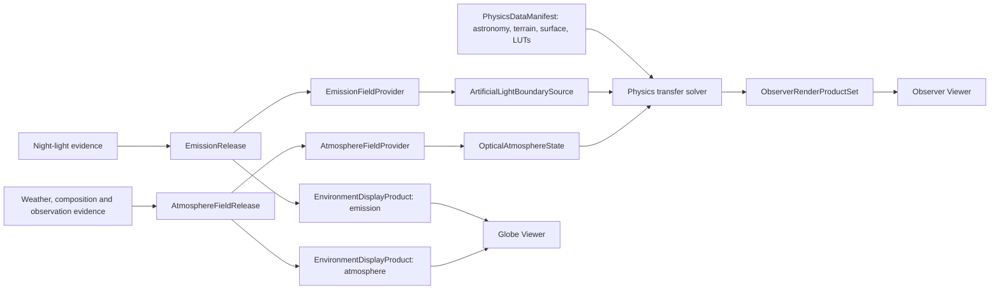

# Night Glow unified system contract

## 1. Purpose

This document is the cross-project vocabulary and lifecycle authority for the
planned Night Glow system. Domain documents remain authoritative for their own
physics and bytes, but they must use the names and boundaries defined here.

The system has three independently releasable product packages and one browser
coordination package:

1. **Environment** reconstructs environmental input products.
2. **Physics** converts those products into sources and optical state, then solves
   astronomy, transfer and observation products.
3. **Viewer** selects scenarios, displays direct map products, renders Physics
   outputs and owns browser/deployment lifecycle.
4. **Coordinator worker** hosts versioned Wasm modules, schedules work, transfers
   buffers, and owns cancellation/runtime lifecycle without owning science.

No package reaches into another package's internal orchestration. Integration is
through immutable products, typed coarse-grained interfaces and conformance
fixtures.

Canonical repository boundaries are:

| Boundary | Path |
| --- | --- |
| production application and WebGL engines | `apps/viewer/` |
| preserved runnable baseline | `apps/reference-viewer/` |
| environmental reconstruction and decoding | `packages/environment/` |
| physics, astronomy, solver, and bindings | `packages/physics/` |
| browser/Wasm coordination | `runtime/browser-worker/` |
| cross-package contracts | `packages/contracts/` |
| system implementation order | `implementation/` |

Native precompute remains co-located with its scientific owner. Root `tools/`
may coordinate packages but never becomes a third home for domain equations or
provider decoders.

The first executable boundary examples live in [`fixtures/v1`](fixtures/v1/README.md).
They freeze only the synthetic first-slice conventions recorded by
[`implementation/decisions/0001`](../../implementation/decisions/0001-first-vertical-slice.md)
and are validated with `make contract-check`. Their public descriptor shapes are
frozen as JSON Schema 2020-12 documents in [`schemas/v1`](schemas/v1/README.md);
Rust decoders add the semantic, conservation, and axis-order checks that cannot
be expressed by shape validation alone.

## 2. Canonical product graph



An optional `EnvironmentReleaseSet` names a pair of independently immutable
`EmissionRelease` and `AtmosphereFieldRelease` products that were tested together.
It never merges their schemas, cells, revisions or update cadence. Every
`ObserverScenario` pins the two domain releases individually; a release-set ID is
provenance/convenience only.

## 3. Canonical names

| Name | Meaning | Owner |
| --- | --- | --- |
| `EmissionRelease` | immutable surface-emission manifests, dictionaries and chunks | Environment emission domain |
| `AtmosphereFieldRelease` | immutable 4-D environmental-state manifests, source runs and chunks | Environment atmosphere domain |
| `EnvironmentDisplayProduct` | deterministic map-oriented derivative of exactly one domain release | Environment producing domain |
| `SurfaceEmissionBatch` | contiguous result of one emission query | Environment format/provider boundary |
| `AtmosphereStateVolume` | contiguous regional 4-D result of one atmosphere query | Environment format/provider boundary |
| `PhysicsDataManifest` | immutable manifest of astronomy, catalogue, diffuse-sky, terrain/surface and lookup-table assets | Physics data/precompute |
| `SurfaceTerrainProduct` | immutable terrain, horizon, surface-state and BRDF inputs used by transfer | Physics data/precompute |
| `EmissionFieldProvider` | Physics-side batch/query adapter over one `EmissionRelease` | Physics adapter; Environment defines producer semantics |
| `AtmosphereFieldProvider` | Physics-side batch/query adapter over one `AtmosphereFieldRelease` | Physics adapter; Environment defines producer semantics |
| `ArtificialLightBoundarySource` | Physics-resolved wavelength/direction/time outgoing source | Physics |
| `OpticalAtmosphereState` | Physics-derived spectral molecular/aerosol/cloud optical volume | Physics |
| `ObserverScenario` | immutable, committed scientific question | Viewer assigns revision; all projects consume |
| `ObserverRenderProductSet` | coherent Physics product family for one scenario/tier | Physics |
| `LayerManifest` / `LayerSample` | Viewer-generic direct-map plugin contract | Viewer |

Do not use `AtlasRelease`, `AtmosphereStateBatch`, generic “weather object,” or
generic “atlas release.” Use the domain-qualified terms above.

## 4. Evidence and selection are different

`SourceEvidenceClass` describes lineage of an individual field/value:

```text
direct_observation
assimilated_analysis
forecast
reanalysis
regional_enrichment
observation_correction
seasonal_anomaly
climatology
inferred_prior
explicit_standard
missing
```

`AtmosphereSelectionMode` describes how one runtime atmosphere was selected:

```text
observation_adjusted_analysis
analysis
forecast
reanalysis
climatology_sample
standard_scenario
insufficient
```

One selected volume may contain several `SourceEvidenceClass` values. A seasonal
anomaly is metadata on a `climatology_sample`, not a deterministic local forecast.
An observation does not become a complete 3-D atmosphere by itself; the normal
observation-backed mode is `observation_adjusted_analysis`. Viewer labels use the
selection mode while inspectors expose the underlying evidence mosaic.

Selection identity is conditional but not free-form. Every selection pins
`atmosphere_release_id`, `requested_time_utc`, and explicit interpolation and
downscaling revisions (including a named `none` revision). Every successful
selection also has `valid_time_utc`:

| `AtmosphereSelectionMode` | Additional required identity |
| --- | --- |
| `observation_adjusted_analysis` | `source_run_id`, `analysis_time_utc`, `observation_correction_revision` |
| `analysis` | `source_run_id`, `analysis_time_utc` |
| `forecast` | `source_run_id`, `analysis_time_utc`, `lead_duration`, and selected/control `ensemble_member_id` |
| `reanalysis` | `source_run_id` |
| `climatology_sample` | `climatology_model_revision`, `climatology_sample_id` |
| `standard_scenario` | `standard_scenario_id` |
| `insufficient` | no `AtmosphereStateVolume`; report `insufficient_evidence` |

## 5. Time identity

Use these exact meanings across manifests, scenarios, URLs and cache keys:

```text
requested_time_utc       time the user asks to observe
analysis_time_utc        model/data-assimilation cycle reference time
valid_time_utc           time represented by a field
lead_duration            valid_time_utc - analysis_time_utc for a forecast
source_run_id            provider + system/model/version + cycle identity
ensemble_member_id       member/control identity when one member is selected
climatology_sample_id    reproducible joint realization identity
standard_scenario_id     named non-evidence fallback identity
time_support             interval/instant and interpolation validity
```

`lead_time`, `run`, `valid`, or `instant` may be UI abbreviations only. Stored
contracts use the complete names. Interpolation does not cross source runs unless
an explicit, revisioned policy permits it.

## 6. Scientific validity, domain status and runtime state

These axes never collapse into one “quality” or “unknown” enum:

```text
DataValidity = valid | missing | masked | censored | not_covered
RuntimeAvailability = idle | loading | available | unavailable | failed
```

Domain status remains domain-specific. Emission uses:

```text
CoverageStatus = supported_emission | supported_dark_or_upper_bound | no_evidence
```

Atmospheric variables retain `SourceEvidenceClass`, QA flags, uncertainty and
representativeness. Physics products separately retain convergence, numerical
residual, validity and approximation/fidelity. A Viewer may map these axes to a
visual legend, but `dark`, `not loaded`, `missing evidence` and physical zero are
never interchangeable.

## 7. Coordinates, vertical support and units

- Horizontal geography is WGS84 geodetic, with north-positive latitude and
  east-positive longitude; cell/grid support is explicit.
- Heights state ellipsoidal, orthometric, geopotential, geometric or
  terrain-relative meaning and datum.
- Atmospheric hybrid/model levels retain coefficients and surface pressure needed
  for reconstruction. Pressure levels are not uniform altitude.
- Local source/observer directions use right-handed east–north–up with declared
  zenith/azimuth conventions.
- Wavelengths are vacuum nanometres unless explicitly declared otherwise.
- Every numeric boundary names quantity, unit, basis, support, axis order, mask
  and uncertainty. No bare position vector, scalar “brightness,” or untyped
  atmosphere crosses a project boundary.

## 8. Canonical release and revision identities

```text
environment_manifest_schema_revision

emission_schema_revision
emission_model_revision
emission_release_id

atmosphere_schema_revision
atmosphere_model_revision
atmosphere_release_id
source_run_id
observation_correction_revision
climatology_model_revision

environment_display_schema_revision
environment_display_build_revision
environment_display_product_id

physics_abi_revision
physics_model_revision
physics_data_manifest_id
atmosphere_optics_model_revision
observer_render_product_schema_revision

viewer_contract_revision
observer_scenario_schema_revision
layer_manifest_schema_revision
scenario_revision
```

Schema revisions change compatibility/meaning/layout. Model revisions change
equations or reconstruction. Release IDs change pinned inputs/configuration and
coverage. Content hashes identify exact bytes. `scenario_revision` is a Viewer
monotonic cancellation/coherence token, not a scientific model version.

## 9. Canonical observer scenario

```text
ObserverScenario {
  observer_scenario_schema_revision
  scenario_revision

  observer_wgs84 { latitude_deg, longitude_deg, height, height_datum }
  requested_time_utc
  astronomy_time_data_ids

  emission_release_id
  emission_time_context
  emission_scenario_policy_id?

  atmosphere_release_id
  atmosphere_selection {
    mode: AtmosphereSelectionMode
    source_run_id?
    analysis_time_utc?
    valid_time_utc
    lead_duration?
    ensemble_member_id?
    observation_correction_revision?
    climatology_model_revision?
    climatology_sample_id?
    standard_scenario_id?
    interpolation_revision
    downscaling_revision
  }

  physics_model_revision
  physics_data_manifest_id
  atmosphere_optics_model_revision
  surface_terrain_product_ids

  output_projection_and_angular_domain
  spectral_basis_or_observer_response
  quality_target
  resource_budget
}
```

Optional fields are conditionally required by `AtmosphereSelectionMode`. The
scenario contains IDs/policy, not embedded global fields or free-form UI sliders.
The worker resolves products and queries; Physics constructs optical state.

## 10. Canonical coarse runtime interfaces

Environment decoding/query:

```text
open_emission_release(manifest, dictionaries) -> emission_release_handle
plan_emission_query(handle, region, time_context, source_policy) -> ChunkPlan
query_emission(handle, request) -> SurfaceEmissionBatch

open_atmosphere_release(manifest, dictionaries) -> atmosphere_release_handle
resolve_atmosphere_selection(handle, requested_time_utc, policy)
    -> AtmosphereSelection
plan_atmosphere_query(handle, curved_earth_region, vertical_support,
                      variables, selection, lod) -> ChunkPlan
query_atmosphere(handle, request) -> AtmosphereStateVolume
```

`register_chunk` and `release_handle` are shared lifecycle operations. Calls are
batch/region sized. No per-cell, per-voxel, per-star, per-ray or per-pixel
JavaScript/Wasm call is permitted.

Viewer-to-coordinator worker protocol:

```text
capabilities() -> capability_and_revision_ranges
initialize(runtime_manifest, capability_profile) -> engine_handle
open_emission_release(manifest, dictionaries) -> emission_release_handle
open_atmosphere_release(manifest, dictionaries) -> atmosphere_release_handle
register_chunk(release_handle, chunk_descriptor, bytes)
register_environment_products(engine_handle, emission_handle, atmosphere_handle)
register_physics_asset(engine_handle, manifest_descriptor, bytes) -> asset_handle
submit_observer_scenario(engine_handle, ObserverScenario) -> scenario_revision
plan_observer_products(engine_handle, scenario_revision, view_descriptor) -> plan_handle
step(plan_handle, work_budget) -> progress + zero/more product descriptors
cancel_scenario(engine_handle, scenario_revision)
release_handle(handle)
shutdown(engine_handle)
```

One coordinator worker is the baseline. Environment decoders and Physics may
share it and exchange contiguous memory without becoming one package. Threads are
an optional measured tier. The coordinator adapts this protocol to each module's
ABI; the Viewer never calls a Physics or Environment Wasm export directly.

### Shared progress and failure vocabulary

Progress stages use the following stable coarse names; domain implementations may
publish a more specific substage without changing the parent stage:

```text
resolve_inputs
load_environment
build_geometry_astronomy
build_optical_state
solve_transfer
apply_observation
publish_products
refine
```

Progress is descriptive, not a promise that every independent job is serialized.
Failures use one top-level category plus structured domain details:

```text
incompatible_schema
incompatible_semantics
invalid_units_or_coordinates
missing_asset
insufficient_evidence
unsupported_capability
numerical_non_convergence
cancelled
resource_exhausted
runtime_failure
```

`DataValidity`, `RuntimeAvailability` and these failure categories remain separate.
For example, a scientifically missing voxel is not a failed network request.

## 11. Computation and ownership order

1. Viewer commits an `ObserverScenario` and assigns `scenario_revision`.
2. Environment resolves the selected emission and atmosphere products and
   returns `SurfaceEmissionBatch` plus `AtmosphereStateVolume`.
3. Physics astronomy resolves time, frames and celestial geometry.
4. Physics constructs `ArtificialLightBoundarySource` and
   `OpticalAtmosphereState` under explicit revisioned policies.
5. Physics selects the curved-Earth source-to-observer volume and solves transfer,
   surface coupling, observation and PSF.
6. Physics publishes an atomic coarse or refined `ObserverRenderProductSet`.
7. Viewer uploads compatible products, composes linear HDR, and applies display
   transforms exactly once.

Independent stages may execute concurrently, but ownership and dependencies do
not change. Environment never propagates light. Physics never performs raw
provider ingest/fusion. Viewer never invents physics or feeds display tiles back
into Physics.

Environment may retain terrain, land/sea, snow, roughness and surface
pressure needed to normalize or interpret its own products. Those contextual
fields are not the transfer solver's lower-boundary authority. Physics owns the
selected `SurfaceTerrainProduct`, including terrain/horizon geometry and surface
reflection state. It reconciles source height, atmosphere terrain masks and the
selected surface geometry exactly once under a revisioned policy.

## 12. Cache and invalidation rule

Every derived cache includes all upstream IDs that can alter its meaning or
bytes. In particular, atmosphere/transfer caches include the atmosphere release,
source run or climatology/standard scenario, exact chunks, interpolation and
downscaling revisions, atmospheric-optics model revision, geometry, wavelength
basis and Physics model revision. Emission caches include release/chunks,
profiles/scenario policy, time context and spectral projection revision.

Only complete validated products enter reusable caches. Cancellation cannot
publish partial fields, kernels or render sets. Display-only state never enters a
scientific cache key.

## 13. Release channels and compatibility handshake

A release channel is a small mutable pointer to immutable products, not a
scientific product and never part of a derived cache key. The Viewer resolves a
channel before committing an `ObserverScenario`; the scenario and shareable URL
pin the resulting `emission_release_id`, `atmosphere_release_id`, selection IDs
and Physics data/model identities. `EnvironmentReleaseSet` may simplify that
resolution but does not replace the pinned domain IDs.

Before enabling a scenario, the Viewer and worker exchange supported ranges and
capabilities for:

```text
viewer_contract_revision
observer_scenario_schema_revision
environment_manifest_schema_revision
emission_schema_revision
atmosphere_schema_revision
environment_display_schema_revision
physics_abi_revision
observer_render_product_schema_revision
layer_manifest_schema_revision
renderer/Wasm capability profile
```

Compatibility is checked before large assets are fetched. A semantically
incompatible model/release fails closed even if its bytes can be decoded.

## 14. Fixtures and release gates

There are four independently owned fixture families:

1. emission-domain release/query conformance;
2. atmosphere-domain release/query conformance;
3. Physics state-to-optics/transfer/render-product conformance;
4. Viewer scenario/decode/upload/display/navigation conformance.

The end-to-end fixture pins all release/model/schema identities and includes a
polluted source region, elevated plume/cloud, cleaner observer region, curved
Earth, explicit missing/censored cases and a climatology selection. Reports keep
source reconstruction, atmospheric state, optical closure, transfer numerics and
display errors separable.

## 15. Deployment rule

Native/offline pipelines ingest global provider archives, fit models, construct
climatologies and publish immutable products. Vercel serves the Viewer shell and
small channel manifests. Content-addressed scientific chunks, catalogues and LUTs
live in object storage/CDN. Browser Wasm decodes/interpolates bounded regional
products and runs interactive Physics; it does not run global NWP, assimilation
or request-time scientific precompute.
