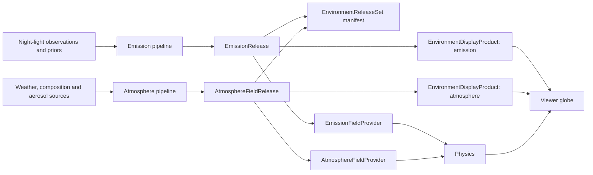

# 20. Environment architecture

## 20.1 Why one workspace

Surface illumination and atmospheric state share difficult engineering infrastructure: global tiled ingestion, coordinate/time normalization, immutable source manifests, uncertainty/evidence states, licence partitions, native precompute, compact browser releases, Wasm decoding and conformance fixtures. Keeping those capabilities in one Rust workspace reduces duplicated plumbing and makes joint release provenance possible.

They do not share one scientific schema. Illumination is a sparse/adaptive surface boundary source. Atmosphere is a dense or adaptively tiled four-dimensional volume with forecast ensembles and climatological distributions. Each changes at a different cadence and must remain independently releasable.

## 20.2 Product graph



`EnvironmentReleaseSet` is only a compatibility/provenance manifest selecting independently immutable products. It is not a file that interleaves emission and weather records.

## 20.3 Proposed crates

| Crate family | Responsibility |
| --- | --- |
| `environment-core` | typed units, WGS84/vertical/time identifiers, evidence, uncertainty, provenance, hashes |
| `environment-manifest` | release-set and compatibility metadata; no domain equations |
| `emission-schema`, `emission-core` | emission records, H3 hierarchy, exact support and profile semantics |
| `emission-ingest-black-marble`, `emission-ingest-osm`, `emission-ingest-built` | native source adapters |
| `emission-fusion`, `emission-format`, `emission-validation` | reconstruction, runtime release and domain evidence |
| `atmosphere-schema` | atmosphere release/run/selection/evidence/vertical records |
| `atmosphere-ingest` | GRIB/netCDF/Zarr/station/satellite readers, native only |
| `atmosphere-normalize` | coordinates, hybrid/model levels, units, QA and source adapters |
| `atmosphere-fusion` | analysis/forecast/reanalysis/observation fusion and uncertainty |
| `atmosphere-climatology` | location/season/local-time distributions and regime priors |
| `atmosphere-format` | chunked `AtmosphereFieldRelease` schema and native/Wasm decoder |
| `atmosphere-validation` | state/profile/forecast/climatology fixtures and release reports |
| `environment-conformance` | cross-domain release-set and end-to-end handoff fixtures; no fusion |

The exact package list is maintained in [`../../crates/README.md`](../../crates/README.md); architecture documents must not invent aliases.

Raw scientific libraries such as ecCodes, netCDF/HDF and heavyweight geospatial dependencies are native-only. Browser Wasm contains schema validation, chunk decoding, interpolation/query and no provider credentials/network policy.

## 20.4 Release identities

Keep these independent:

```text
environment_manifest_schema_revision
emission_schema_revision / emission_model_revision / emission_release_id
atmosphere_schema_revision / atmosphere_model_revision / atmosphere_release_id
source_run_id / analysis_time_utc / valid_time_utc / lead_duration
ensemble_member_id / climatology_sample_id / standard_scenario_id
observation_correction_revision / climatology_model_revision / climatology_baseline_period
environment_display_schema_revision / environment_display_build_revision / environment_display_product_id
physics_abi_revision
physics_model_revision
physics_data_manifest_id
atmosphere_optics_model_revision
observer_render_product_schema_revision
viewer_contract_revision
observer_scenario_schema_revision
layer_manifest_schema_revision
scenario_revision
```

Updating a CAMS forecast does not invalidate the annual emission release. Correcting illumination reconstruction does not require rebuilding ERA5 climatology. A Physics cache key binds the exact pair it consumed.

## 20.5 Domain dependency rules

1. Emission and atmosphere crates may share only core units/provenance/format primitives.
2. Atmospheric concentration may use urban/industrial/fire emission inventories as a prior, but never the night-light brightness field as a causal pollution measurement.
3. Correlation between bright cities and aerosol may be studied, but neither field is calibrated by forcing end-to-end skyglow agreement.
4. Physics depends on published domain contracts; neither Environment domain depends on Physics internals.
5. Viewer display products derive from releases and cannot become scientific inputs by reverse colour lookup.
6. Each source and derived output retains its own licence partition and attribution.

## 20.6 Runtime selection

For a query location/time, the coordinator selects an `AtmosphereSelectionMode`:

```text
observation-adjusted current state -> observation_adjusted_analysis
near real time                     -> analysis
forecast horizon                   -> forecast
supported historical time         -> reanalysis
seasonal/arbitrary unsupported time -> climatology_sample
explicit fallback request          -> standard_scenario
no defensible construction         -> insufficient
```

Transitions are governed by product metadata, not hard-coded dates in the UI. A result always states the selection mode and retains the independent `SourceEvidenceClass` mosaic for its fields. Seasonal anomalies condition a climatology sample; they are not a separate deterministic local mode.

## 20.7 Compute boundary

Environment precompute may be substantial, but interactive browser work is bounded: locate relevant spatial/vertical/time chunks, interpolate state, select/sample a scenario and hand contiguous arrays to Physics. It does not rerun a global weather model or chemical transport model in Wasm.

Physics may compute optical coefficients and transfer on the fly using these fields. “Rust is fast” does not make downloading or solving a global NWP model per user reasonable; preprocessing, chunking and cache design remain essential.
