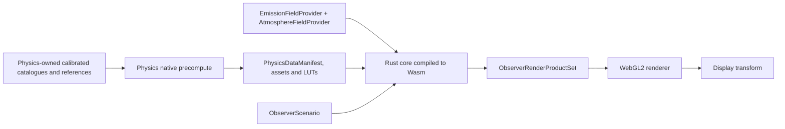

# Architecture

## 1. Architectural objective

The toolkit should make every physical assumption locatable and reviewable while avoiding two implementations of the same mathematics. A calculation belongs in exactly one domain module. Execution targets select algorithms and precision profiles, but do not redefine equations.



Native and Wasm builds share `nightglow-core`, `nightglow-physics`, `nightglow-astronomy`, `nightglow-data`, and `nightglow-solver`. The native application adds heavyweight importers and reference solvers. The Wasm binding exposes a coarse asynchronous API and excludes filesystem/network policy.

## 2. Crate responsibilities

### `nightglow-core`

Owns typed physical quantities, wavelength grids, directions, coordinate identifiers, spatial grids, tensor layouts, errors, stable asset identifiers, and revision hashes. It must not know about browsers, files, Gaia, or a particular scattering model.

### `nightglow-physics`

Owns the equations for atmosphere, scattering, refraction, surface response, celestial radiance, artificial emission, diffuse sky, and PSF. Each phenomenon is a module with explicit inputs, outputs, assumptions, differentiability, conservation rules, and fidelity levels.

### `nightglow-astronomy`

Owns time scales, reference-frame transformations, Earth orientation, ephemerides, apparent positions, stellar kinematics, visibility, and multiresolution sky indexing. It answers **where an object is and how its intrinsic source state changes**. It does not perform atmospheric transport.

### `nightglow-data`

Owns Physics asset schemas/readers and conforming Environment Atlas consumer adapters. Importing raw Physics-owned scientific products is native-only, but runtime decoding and provenance checking are shared. It does not define competing emission/atmosphere schemas or ingest their raw providers. Every loaded asset carries source, units, calibration transform, `DataValidity`, uncertainty, licence, model revision, and content hash.

### `nightglow-solver`

Owns the computation DAG, invalidation, caches, cancellation, progressive refinement, work budgets, and assembly of domain modules. It is the only place allowed to decide execution order. It must not hide new physics inside scheduling code.

### `nightglow-validation`

Owns test scenarios, invariants, convergence sweeps, golden numeric outputs, uncertainty comparisons, and adapters to trusted reference calculations. It is compiled for native verification first; a small invariant subset may run in Wasm.

### `apps/precompute`

A deterministic native CLI that turns Physics-owned raw catalogues/reference products and frozen Environment Atlas releases into browser-sized, indexed, checksummed Physics assets. It never repeats environmental provider ingest/fusion. It constructs expensive transfer tables and reference results. A run emits an immutable manifest and a report separating validity, input uncertainty and numerical convergence.

### `bindings/wasm`

A thin ABI around shared Rust. It manages handles, typed-array views, worker-safe messages, and feature detection. It must not contain alternative formulas, catalogue parsing policy, rendering logic, or JSON-sized per-pixel traffic.

## 3. Dependency rules

```text
nightglow-core
├── nightglow-physics
├── nightglow-astronomy
└── nightglow-data
        └────────────┐
nightglow-physics ───┤
nightglow-astronomy ─┼──> nightglow-solver ──> precompute / wasm
nightglow-data ──────┤
nightglow-validation ┘ (native verification and optional small runtime checks)
```

Rules:

1. `core` has no domain dependencies.
2. Physics may consume astronomy result types but never call a browser clock or fetch data.
3. Astronomy never depends on atmospheric or display models.
4. Data provides values and metadata, not equations.
5. Solver composes modules through explicit inputs; it does not reach into private state.
6. Wasm and precompute may depend on the solver, never the reverse.
7. WebGL consumes a versioned render contract and cannot be imported by any Rust physics crate.

## 4. Module contract

Every physical module must document and expose the equivalent of:

```text
Inputs
  typed state + explicit coordinate frame + epoch + spectral basis
Outputs
  typed result + units + DataValidity + uncertainty + model revision
Model
  equation family + approximations + validity domain
Numerics
  algorithm + tolerance + fidelity profile + convergence/residual + deterministic behavior
Validation
  invariants + reference datasets/codes + convergence cases
Dependencies
  upstream physical states, never hidden globals
```

Parameters are immutable scenario values. Outputs never rely on ambient process state. Units cannot be bare unlabelled `f32` at crate boundaries.

## 5. Fidelity profiles

The equations remain common, but algorithms can be selected explicitly:

| Profile | Intended use | Typical characteristics |
|---|---|---|
| Reference | research and regression | `f64`, adaptive quadrature, maximum scattering order, uncertainty output |
| Precompute | asset production | deterministic parallel native solve, convergence recorded per tile/LUT |
| Interactive high | capable browser | precomputed transfer plus `f32`/mixed precision source evaluation and progressive refinement |
| Interactive fallback | constrained browser | reduced angular/spectral LOD with the same physical quantities and declared error bounds |

A fidelity profile may reduce samples or choose an approximation. It may not silently change units, coordinate conventions, or the meaning of a parameter.

## 6. Environment Atlas boundary

`environment-atlas/` is a sibling Rust workspace with two expert domains and two independent releases. `EmissionRelease` is a sparse, mixed-resolution H3 source product whose conserved baseline is `J_DNB [W sr^-1]`. `AtmosphereFieldRelease` is a four-dimensional state product containing meteorology, aerosols, clouds, evidence/time semantics, uncertainty and provenance. An optional release-set manifest only records tested compatibility; it does not merge their schemas or cadence.

The dependencies are one-way:

```text
EmissionRelease   -> nightglow-data::emission_adapter
                  -> nightglow-physics::artificial-light ─┐
AtmosphereFieldRelease -> nightglow-data::atmosphere_adapter
                  -> nightglow-physics::atmosphere/optics ├-> nightglow-solver
astronomy/surface/other source products ──────────────────┘
```

The atlas owns raw satellite/inventory/geometry inference, weather/composition acquisition and fusion, climatological fallbacks, chunks, evidence classes and release semantics. Physics owns compatibility checks, explicit scenario policy, state-to-optics conversion, source construction, curved-Earth transfer and propagation. Browser Wasm decodes/interpolates regional products; it does not run global NWP or data assimilation. Physics may depend on published schema/format crates or conforming decoders; the atlas never depends on Physics.

Physics must preserve `J_DNB`, corrected reference-view meaning, resolved/unresolved profile states, exact WGS84 support, uncertainty, evidence, provenance, and licence partition. It must not silently multiply by `pi`, choose a typical spectrum, or apply the ground BRDF to the already-outgoing initial atlas value. The complete boundary is [the Environment Atlas emission domain consumer contract](docs/contracts/EMISSION_RELEASE_CONTRACT.md).

For atmospheric state, Physics must preserve `AtmosphereSelectionMode`, `source_run_id`, analysis/valid/lead/member or climatology/standard identity, `observation_correction_revision`, `climatology_model_revision`, vertical coordinates, units, wet/dry optical convention, `DataValidity`, per-field `SourceEvidenceClass`, uncertainty and licence provenance. It must not treat PM or AOD as a complete optical state, double-apply humidity growth, or interpret missing data as clean air. It queries the complete source-to-observer scattering volume rather than only the local column. The complete umbrella boundary is [the Environment Atlas consumer contract](docs/contracts/ENVIRONMENT_ATLAS_CONTRACT.md).

## 7. Deployment boundary

Vercel serves static code, immutable data tiles, and headers. The browser performs interactive source evaluation in workers and rendering in WebGL2. Global raw-data preparation, large catalogue joins, and reference radiative-transfer solves occur offline, not in Vercel Functions.

Optional threaded Wasm requires cross-origin isolation (`COOP` and `COEP`). The architecture must also work with a single worker because embedding, third-party assets, or browser support may prevent isolation. Asset URLs are content-addressed so they can be cached indefinitely at the edge.
