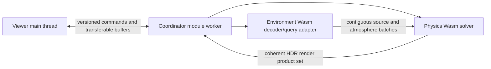

# Night Glow coordinator worker

This runtime defines the production browser worker that connects the Viewer to
the independently versioned Environment and Physics WebAssembly modules. It is a
runtime and scheduling boundary, not a scientific package.

## Ownership

The worker owns:

- capability discovery and Wasm module loading;
- scenario-scoped handles and immutable request identities;
- coarse chunk and buffer transfer between Environment, Physics, and Viewer;
- bounded scheduling, progress, cancellation, and stale-result rejection;
- explicit buffer lifetime, memory accounting, and structured failures;
- cache coordination without changing scientific cache keys or revision rules.

It does not own physical equations, environmental reconstruction semantics,
WebGL resources, tone mapping, application state, provider downloads, or Vercel
publication jobs. Environment and Physics remain independently testable native
and Wasm packages even if one worker hosts both modules.

## Baseline topology



The required baseline is one module worker and non-threaded Wasm. SIMD, Wasm
threads, `SharedArrayBuffer`, and additional workers are capability-gated
accelerators, never correctness requirements. Calls are scenario-, tile-, batch-,
or field-sized; no per-cell, per-star, per-ray, or per-voxel JavaScript loop is
part of the architecture.

## Protocol surface

The canonical command vocabulary and lifecycle live in the
[unified contract](../../packages/contracts/README.md). The first implementation should expose
coarse operations equivalent to:

1. initialize runtime and report capabilities;
2. load and validate immutable release/module manifests;
3. commit or cancel an `ObserverScenario` revision;
4. resolve Environment chunks and build contiguous query products;
5. run bounded Physics stages with progress and cancellation points;
6. return one coherent `ObserverRenderProductSet` or structured failure;
7. release scenario, product, cache, buffer, and runtime handles explicitly.

Messages must carry protocol and schema revisions, request and scenario revision,
dependency identities, and transfer ownership. Results from superseded scenarios
are discarded before they can mutate Viewer state.

## Implemented first slice

```text
runtime/browser-worker/
├── README.md                 this reviewed boundary
├── fixtures/v1/
│   └── runtime-compatibility-manifest.json
│                             pinned fixture identity allow-list
├── package.json              dependency-free Node protocol tests
├── src/
│   ├── coordinator.js        testable runtime lifecycle and Wasm host
│   └── coordinator.worker.js thin module-worker message adapter
└── test/
    └── coordinator.test.js   protocol, cancellation, parity, and memory tests
```

The coordinator instantiates the independently built Environment and Physics
Wasm modules, validates ABI revisions plus an immutable compatibility manifest,
and rejects unregistered Environment/Physics/data/terrain identities before
execution. It transfers one field-sized Environment buffer, publishes progress
at bounded cancellation points, rejects superseded work, explicitly invalidates
Wasm request/output views on success and failure, and returns a copied coherent
float product with memory accounting. Runtime disposal cancels pending work,
releases Wasm-owned views, and drops both module instances. Repeated scenario
tests verify stable linear-memory size after warm-up. The worker wrapper transfers
product-buffer ownership to its caller and maps failures to stable categories.

The implementation is deliberately fixture-sized. It does not fetch provider
assets, manage production release handles/caches, run threads, or contain a
scientific equation. No Viewer code or build step is required to test it; run
`make coordinator-test` from the repository root.

Related plans: [Viewer rendering and workers](../../apps/viewer/docs/architecture/rendering-and-workers.md),
[Physics Wasm ABI](../../packages/physics/docs/contracts/wasm-abi.md), and
[Environment format/API](../../packages/environment/docs/emission/format-and-api.md).
