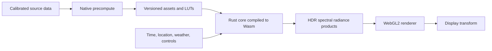

# Architecture

## 1. Architectural objective

The toolkit should make every physical assumption locatable and reviewable while avoiding two implementations of the same mathematics. A calculation belongs in exactly one domain module. Execution targets select algorithms and precision profiles, but do not redefine equations.



Native and Wasm builds share `nightglow-core`, `nightglow-physics`, `nightglow-astronomy`, `nightglow-data`, and `nightglow-solver`. The native application adds heavyweight importers and reference solvers. The Wasm binding exposes a coarse asynchronous API and excludes filesystem/network policy.

## 2. Crate responsibilities

### `nightglow-core`

Owns typed physical quantities, wavelength grids, directions, coordinate identifiers, spatial grids, tensor layouts, errors, stable asset identifiers, and revision hashes. It must not know about browsers, files, Gaia, or a particular scattering model.

### `nightglow-physics`

Owns the equations for atmosphere, scattering, refraction, surface response, celestial radiance, artificial emission, diffuse sky, and PSF. Each phenomenon is a module with explicit inputs, outputs, assumptions, differentiability, conservation rules, and fidelity levels.

### `nightglow-astronomy`

Owns time scales, reference-frame transformations, Earth orientation, ephemerides, apparent positions, stellar kinematics, visibility, and multiresolution sky indexing. It answers **where an object is and how its intrinsic source state changes**. It does not perform atmospheric transport.

### `nightglow-data`

Owns schemas and readers for precomputed assets. Importing raw scientific products is native-only, but runtime decoding and provenance checking are shared. Every loaded asset carries source, units, calibration transform, uncertainty, license, model revision, and content hash.

### `nightglow-solver`

Owns the computation DAG, invalidation, caches, cancellation, progressive refinement, work budgets, and assembly of domain modules. It is the only place allowed to decide execution order. It must not hide new physics inside scheduling code.

### `nightglow-validation`

Owns test scenarios, invariants, convergence sweeps, golden numeric outputs, uncertainty comparisons, and adapters to trusted reference calculations. It is compiled for native verification first; a small invariant subset may run in Wasm.

### `apps/precompute`

A deterministic native CLI that turns raw catalogues and geophysical products into browser-sized, indexed, checksummed assets. It also constructs expensive transfer tables and reference results. A run emits an immutable manifest and a machine-readable quality report.

### `bindings/wasm`

A thin ABI around shared Rust. It manages handles, typed-array views, worker-safe messages, and feature detection. It must not contain alternative formulas, catalogue parsing policy, rendering logic, or JSON-sized per-pixel traffic.

## 3. Dependency rules

```text
nightglow-core
├── nightglow-physics
├── nightglow-astronomy
└── nightglow-data
        └────────────┐
nightglow-physics ───┤
nightglow-astronomy ─┼──> nightglow-solver ──> precompute / wasm
nightglow-data ──────┤
nightglow-validation ┘ (native verification and optional small runtime checks)
```

Rules:

1. `core` has no domain dependencies.
2. Physics may consume astronomy result types but never call a browser clock or fetch data.
3. Astronomy never depends on atmospheric or display models.
4. Data provides values and metadata, not equations.
5. Solver composes modules through explicit inputs; it does not reach into private state.
6. Wasm and precompute may depend on the solver, never the reverse.
7. WebGL consumes a versioned render contract and cannot be imported by any Rust physics crate.

## 4. Module contract

Every physical module must document and expose the equivalent of:

```text
Inputs
  typed state + explicit coordinate frame + epoch + spectral basis
Outputs
  typed result + units + uncertainty/quality + model revision
Model
  equation family + approximations + validity domain
Numerics
  algorithm + tolerance + precision profile + deterministic behavior
Validation
  invariants + reference datasets/codes + convergence cases
Dependencies
  upstream physical states, never hidden globals
```

Parameters are immutable scenario values. Outputs never rely on ambient process state. Units cannot be bare unlabelled `f32` at crate boundaries.

## 5. Fidelity profiles

The equations remain common, but algorithms can be selected explicitly:

| Profile | Intended use | Typical characteristics |
|---|---|---|
| Reference | research and regression | `f64`, adaptive quadrature, maximum scattering order, uncertainty output |
| Precompute | asset production | deterministic parallel native solve, convergence recorded per tile/LUT |
| Interactive high | capable browser | precomputed transfer plus `f32`/mixed precision source evaluation and progressive refinement |
| Interactive fallback | constrained browser | reduced angular/spectral LOD with the same physical quantities and declared error bounds |

A fidelity profile may reduce samples or choose an approximation. It may not silently change units, coordinate conventions, or the meaning of a parameter.

## 6. Existing-package boundary

`emission-atlas/` currently models a sparse H3 global emission field with spectral, temporal, angular, evidence, and power semantics. During review it remains a sibling package. The proposed adapter is:

```text
EmissionFieldProvider
  query region/time/LOD
    -> upward spectral radiant intensity or flux
       + angular profile
       + uncertainty/evidence
       + spatial support
```

The physics toolkit will convert that boundary quantity into propagation source terms. It must not infer upward light from a display image or treat satellite at-sensor radiance as direct upward flux without an inversion model.

## 7. Deployment boundary

Vercel serves static code, immutable data tiles, and headers. The browser performs interactive source evaluation in workers and rendering in WebGL2. Global raw-data preparation, large catalogue joins, and reference radiative-transfer solves occur offline, not in Vercel Functions.

Optional threaded Wasm requires cross-origin isolation (`COOP` and `COEP`). The architecture must also work with a single worker because embedding, third-party assets, or browser support may prevent isolation. Asset URLs are content-addressed so they can be cached indefinitely at the edge.
