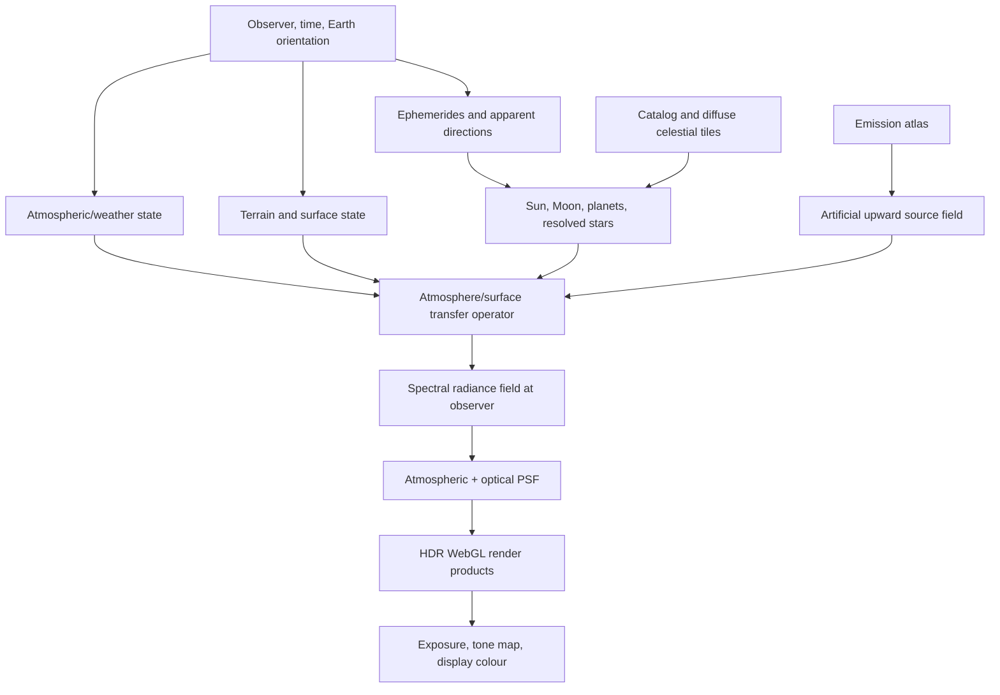

# Computation DAG and update order

The physical model is not a sequence of painted layers. It is a dependency graph whose intermediate results have explicit physical meanings. Independent work should run concurrently; dependent work must retain its order.

## 1. Scenario state

A scenario revision contains observer geodetic position and height; UTC and required time-scale conversions; atmospheric vertical profiles; aerosols; clouds; ozone; surface/terrain state; emission-atlas revision; catalogue revisions; spectral basis; fidelity profile; and instrument/eye observation model.

Every result is tagged with the scenario revision and the hashes of upstream assets. Late worker results from an older revision are discarded.

## 2. Required physical order

1. Convert time and observer state into Earth orientation and reference-frame transforms.
2. Compute geometric and apparent directions, distances, phases, occultations, and horizon intersections.
3. Load spatial/spectral LOD for stars, diffuse celestial sky, terrain, albedo, atmosphere, clouds, and artificial emission.
4. Construct atmospheric optical properties and surface boundary response.
5. Construct or select the reusable transfer operator for the atmosphere/surface state.
6. Evaluate source boundary conditions: solar, lunar, planetary, stellar, diffuse, airglow, zodiacal, and artificial.
7. Propagate sources through the common transfer operator, including multiple scattering and surface coupling according to fidelity.
8. Sum **linear spectral radiance** contributions only after each contribution is expressed on a compatible basis and grid.
9. Apply refraction and the observation PSF at the correct stage and angular support.
10. Produce HDR render resources; apply exposure and display colour exactly once in the renderer.

“Weather and sky first, then planets” is a useful scheduling intuition, but opacity and scattering cannot be finalized independently of direction and spectrum. The solver therefore builds reusable atmosphere/surface state first, computes celestial geometry in parallel, and joins them at source propagation.

## 3. Parallel branches

Once time/frame state exists, the following may run concurrently:

- Sun, Moon, and planetary ephemerides;
- stellar tile selection and proper-motion propagation;
- diffuse Milky Way and zodiacal tile selection;
- local weather profile construction;
- terrain horizon and surface tile selection;
- artificial-emission tile selection;
- cached transfer/LUT lookup.

Per-source propagation can run concurrently only if the transfer formulation is linear for the selected state. Nonlinear coupling, such as cloud microphysics changes or a state-dependent observation model, requires a new transfer revision rather than unsafe summation.

## 4. Progressive refinement

The first visible result should be physically coherent, not a mixture of current and stale layers:

1. Coarse all-sky atmosphere and bright-source result.
2. Visible bright-star catalogue and coarse diffuse sky.
3. Refined horizon/terrain and local artificial emission.
4. Higher scattering order and angular refinement where estimated error is largest.
5. Fainter catalogue tiers, refined Milky Way tiles, and higher-quality PSF.

Each tile carries LOD, error estimate, scenario revision, and spectral/grid identity. Replacement is atomic at tile boundaries. Refinement priority is based on projected screen error, radiance contribution, and physical residual—not simply distance from the camera.

## 5. Cache hierarchy

| Cache | Key includes | Reusable across |
|---|---|---|
| Ephemeris | time range, body, ephemeris revision | nearby frames/times |
| Catalogue tile | sky cell, magnitude/quality tier, epoch basis | observers |
| Surface/emission tile | spatial cell, LOD, dataset revision | times until temporal factor changes |
| Optical state | atmosphere profile, wavelength basis | source directions |
| Transfer LUT | optical state, geometry/grid, model revision | all linear sources |
| Source projection | source state, transfer hash | display changes |
| PSF kernel | seeing/instrument state, wavelength, angular sampling | sources in validity region |
| Render product | all physical hashes, output grid | exposure/tone-map changes where HDR retained |

Only completed, validated results enter shared caches. Cancellation must never publish partial LUTs or emission grids.

## 6. Non-blocking execution

- The main browser thread performs UI and WebGL submission only.
- One coordinator worker owns the Wasm solver and schedules bounded jobs.
- Optional additional workers use a shared Wasm memory only under cross-origin isolation.
- Without shared memory, jobs use transferable `ArrayBuffer`s and spatially coarse task boundaries.
- Every job has cancellation/revision checks at bounded intervals.
- Wasm calls are coarse: a tile, band block, star batch, or solve step—not one call per ray or pixel.
- Progress reports completed work, residual/error, and stage; it never implies convergence merely from elapsed percentage.
