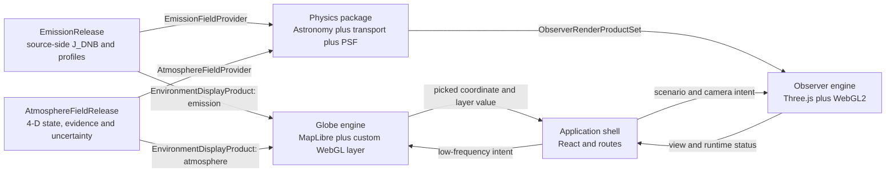
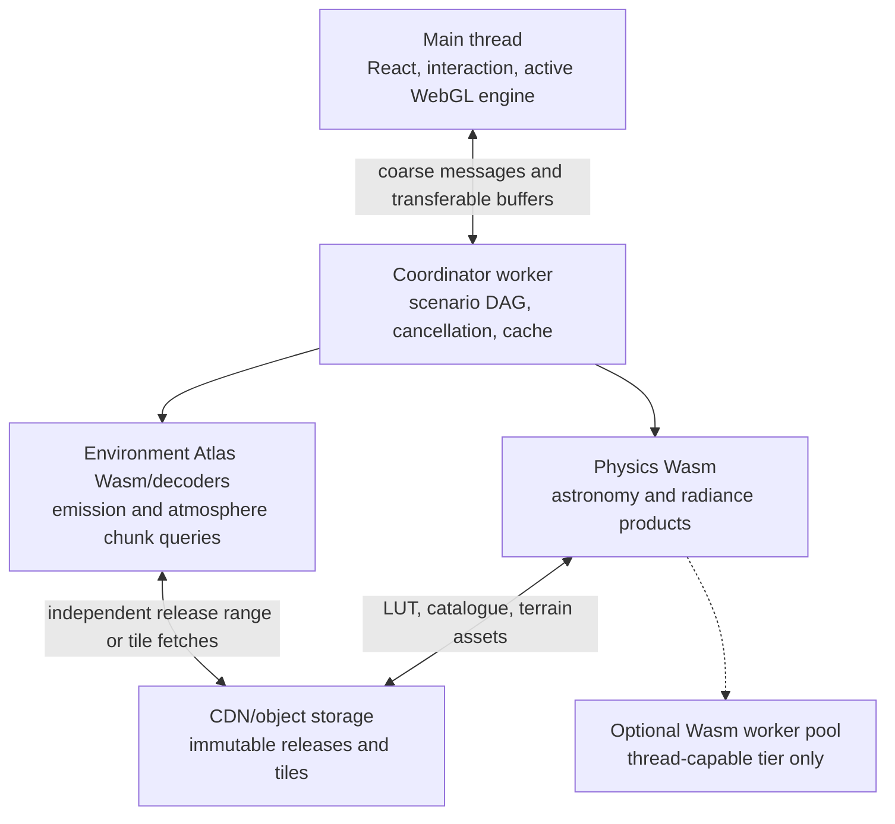

# Viewer architecture

## 1. Purpose

The Viewer turns versioned scientific products into two coherent interactive experiences without becoming a third physics implementation. It coordinates application state, workers, WebGL resources, interaction, and display transforms. It must remain possible to replace the globe engine, renderer, or UI framework without changing a physical equation.

## 2. System context



There are deliberately two Environment Atlas consumption paths. The globe visualizes emission or atmospheric statistics directly. The observer view receives propagated radiance from Physics; it must not treat a bright emission cell, PM pixel, AOD column or palette colour as observer sky radiance or a complete optical volume.

## 3. Ownership

| Concern | Owner | Viewer responsibility |
| --- | --- | --- |
| Source reconstruction, `J_DNB`, source profiles and release QA | Environment Atlas emission domain | Select, decode, display, attribute |
| Meteorology/aerosol/cloud acquisition, fusion, climatology and state QA | Environment Atlas atmosphere domain | Select evidence/run/sample, decode, display, attribute |
| Astronomy, state-to-optics closure, Earthshine, moonlight, light propagation, PSF | Physics | Submit scenario, show progress, upload products |
| Scientific units and coordinate transforms at handoff | Producing package | Validate descriptors; never infer silently |
| Camera, picking, route transitions, panels, legends and accessibility | Viewer | Full ownership |
| HDR framebuffer composition and display transform | Viewer renderer | Preserve linear inputs; apply once |
| Palette for a thematic map | Viewer layer | Display-only, unit-labelled, versioned preset |
| Physical false colour or observer response matrix | Physics contract | Apply declared matrix exactly once |
| GPU and worker resource lifetime | Viewer | Allocate, reuse, cancel, dispose, recover |

## 4. Application architecture

### 4.1 Route shell

Use Next.js App Router for the product shell, metadata, shareable routes, static explanatory pages, error boundaries, and future server-facing product features. Keep server-rendered components limited to content that does not touch browser APIs. The GPU routes are Client Components loaded dynamically with server-side rendering disabled.

Proposed routes:

```text
app/
├── layout.tsx
├── page.tsx                 redirects or introduces the globe
├── globe/page.tsx
├── observe/page.tsx
├── about/page.tsx
└── methodology/page.tsx
```

`/globe` and `/observe` must be separate route bundles. The app shell can persist, but neither Three.js nor observer Physics resources should load for a globe-only visit. Conversely, the full globe should not remain alive behind the observer route.

### 4.2 UI and engine separation

React owns declarative controls and low-frequency product state. It does not own the render loop, GPU handles, camera matrices, large typed arrays, or per-frame pointer deltas.

Each engine exposes a narrow imperative interface:

```ts
interface ViewEngine<Intent, Snapshot> {
  mount(canvasOrHost: HTMLElement): Promise<void>
  apply(intent: Intent): void
  snapshot(): Snapshot
  pause(): void
  resume(): void
  dispose(): Promise<void>
}
```

Engine events are semantic—`location-picked`, `camera-settled`, `context-lost`, `quality-changed`—rather than a stream of frame state. React subscribes through a small external store or `useSyncExternalStore`-compatible adapter.

### 4.3 State layers

1. **URL state:** active view, committed location, requested time, layer, domain release IDs, atmosphere selection, optional shareable camera.
2. **Product state:** selected releases, compute status, quality profile, capability tier, provenance.
3. **Session state:** panel layout, recent locations, uncommitted map preview, last camera per mode.
4. **Engine-private state:** frame clock, matrices, GPU allocations, worker handles, staging buffers.

Only the first two should drive scientific recomputation. See [STATE_AND_NAVIGATION.md](STATE_AND_NAVIGATION.md).

## 5. Render engines

### 5.1 Globe

Use MapLibre GL JS because the product is fundamentally a global thematic map: it needs globe projection, vector basemaps, labels, picking, zoom, 2-D/3-D transition, raster/vector sources, and custom WebGL layers. Custom layers render emission and atmospheric surface/column/slice overlays in the same context while MapLibre manages projection and camera.

CesiumJS remains the fallback decision if photorealistic terrain, 3D Tiles, orbital viewing, or globe-scale volumetric data becomes the dominant experience. Those needs are not currently strong enough to accept its heavier product model for both globe and mini-map.

### 5.2 Observer

Use an imperative Three.js renderer as a WebGL2 resource manager and scene abstraction. Do not use React Three Fiber as the core scene architecture: the scientific renderer updates large buffers, versioned textures, and specialized passes, and it already has an imperative behavioral baseline. A future renderer may use raw WebGL2 for selected passes without changing the UI contract.

The observer renderer receives render products, not physical inputs. It may perform projection, interpolation, validated PSF reconstruction, HDR composition, and display mapping as permitted by the Physics WebGL contract.

## 6. Runtime and worker topology



The first production tier uses one coordinator worker. Optional internal Wasm threading is enabled only after cross-origin isolation, browser coverage, memory use, and real workload speedups are measured. No UI code loops over atlas cells or calls Wasm once per star/pixel.

## 7. Scientific scenario identity

Every observer request is the canonical `ObserverScenario` from the [unified system contract](../docs/system-contract.md), containing at minimum:

- `observer_scenario_schema_revision`;
- `scenario_revision` generated by the Viewer;
- WGS84 observer position and height;
- `requested_time_utc` and astronomy time-data IDs;
- independent emission and atmosphere release identities;
- emission time context/scenario policy;
- `AtmosphereSelectionMode` and its conditionally required source-run/analysis/valid/lead/member, observation-correction, climatology-model/sample or standard-scenario identity;
- Physics model/data and atmospheric-optics model identities;
- interpolation/downscaling revisions and surface/terrain product IDs;
- requested output projection, spectral/observer basis, angular resolution, and quality profile.

All progress and outputs echo this identity. The Viewer uploads only complete products for the current revision. It may display the last coherent revision while a new one computes, clearly labelled as updating.

## 8. Dependency rules

- `components` may depend on state and engine interfaces, never Wasm exports.
- `engines` may depend on render descriptors, never Environment Atlas schema internals or physical modules.
- `runtime/environment` owns separate emission/atmosphere schema decoding and adaptation to Viewer display tiles or Physics provider buffers.
- `runtime/physics` owns the Wasm ABI and converts outputs to renderer descriptors.
- emission, atmosphere, Physics and Viewer versions are independent; a compatibility table or capability handshake binds them.
- No dependency from either scientific project back into the Viewer.
- No request-time Vercel function is part of the physical compute path.

## 9. Failure and fallback

Capability negotiation chooses a named tier, not a series of invisible reductions. At minimum:

| Tier | Globe | Observer |
| --- | --- | --- |
| Full | HDR custom layer, high-resolution tiles | Float HDR, full catalogue/PSF, optional Wasm threads |
| Standard | WebGL2 overlay, bounded DPR/LOD | WebGL2, single worker, reduced angular/catalogue LOD |
| Constrained | lower tile/texture budget | lower sky grid, smaller catalogue, explicit quality label |
| Unsupported | accessible static map/data table | explanatory fallback; never a misleading fake sky |

Context loss, worker failure, out-of-memory, missing assets, and incompatible releases each receive a distinct recoverable state and telemetry event. Worker failures retain the unified top-level codes (`runtime_failure`, `resource_exhausted`, `missing_asset`, `incompatible_schema`, or `incompatible_semantics`) plus structured recovery details; WebGL context loss remains a Viewer engine event rather than a scientific failure.

## 10. Architectural acceptance criteria

Before broad implementation:

1. A globe proof renders one real or synthetic `EnvironmentDisplayProduct` through a MapLibre custom layer with correct picking and globe projection.
2. An observer proof loads a tiny Wasm module in a worker and transfers a float radiance texture to Three.js without copying through ordinary arrays.
3. Route transitions prove only one full-rate render loop and bounded WebGL contexts.
4. A shared scenario descriptor crosses UI → worker → renderer with revision cancellation.
5. A deployment proof confirms Wasm MIME type, asset caching, cross-origin headers, and all third-party asset CORS/CORP behavior on Vercel.
